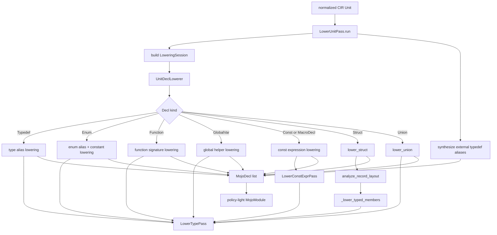

# Analysis Type Lowering Pipeline

This document shows how normalized CIR lowers into MojoIR in the `analysis`
layer.

## Overview

## Main Components

### `LowerUnitPass`

`LowerUnitPass` owns the top-level walk over a normalized CIR `Unit`.

Responsibilities:
- create one shared `LowerTypePass`
- create one shared `LowerConstExprPass`
- build `StructLoweringContext` from the normalized record map and target ABI
- synthesize aliases for externally referenced typedefs that are used but not
  declared locally in the current `Unit`
- delegate each top-level declaration to `UnitDeclLowerer`

Source:
- [unit_lowering.py](/home/mohamed/Documents/Projects/mojo_bindgen/mojo_bindgen/analysis/mojo/unit_lowering.py:45)

### `LowerTypePass`

`LowerTypePass` converts one parser-facing `Type` into one valid Mojo-facing `Type`.

Important rules:
- primitive C scalars lower to `BuiltinType` or fixed-width `NamedType`
- exact-width aliases such as `int32_t` and `uint64_t` lower to Mojo fixed-width names
- `size_t` and `ssize_t` lower to `UInt` and `Int`
- representable atomics lower to `Atomic[...]`
- data pointers lower to nullable `Pointer`
- vectors lower to `SIMD[...]` when lane metadata is usable
- complex values lower to `ComplexSIMD[...]`
- unsupported fixed-size types fall back to byte arrays
- unsupported unsized types fall back to opaque external pointers

Source:
- [type_lowering.py](/home/mohamed/Documents/Projects/mojo_bindgen/mojo_bindgen/analysis/mojo/type_lowering.py:132)

### `UnitDeclLowerer`

`UnitDeclLowerer` is the declaration-family dispatcher inside the lowering
session.

Responsibilities:
- lower typedefs and enums into aliases and constants
- lower functions into `FunctionDecl`
- lower globals into `GlobalDecl`
- lower structs through `lower_struct(...)`
- lower unions through `lower_union(...)`
- lower CIR constant expressions and macro expressions through `LowerConstExprPass`

Source:
- [decl_lowerer.py](/home/mohamed/Documents/Projects/mojo_bindgen/mojo_bindgen/analysis/mojo/decl_lowerer.py:93)

### `lower_struct(...)`

Struct lowering is factored around real record layout analysis plus typed member
planning.

Responsibilities:
- compute pure layout facts with `analyze_record_layout(...)`
- reject incomplete or non-representable layouts onto opaque storage
- lower plain stored fields and bitfield storage/logical field types
- synthesize padding members and initializers from analyzed layout facts
- preserve flexible-tail metadata when the enclosing shape stays representable
- attach fallback diagnostics when a record must collapse to opaque storage

Source:
- [struct_lowering.py](/home/mohamed/Documents/Projects/mojo_bindgen/mojo_bindgen/analysis/mojo/struct_lowering.py:56)
- [record_layout.py](/home/mohamed/Documents/Projects/mojo_bindgen/mojo_bindgen/analysis/facts/record_layout.py:48)

### `lower_union(...)`

Union lowering decides whether a union can stay as a typed `UnsafeUnion[...]`
surface or must fall back to a conservative layout alias.

Source:
- [union_lowering.py](/home/mohamed/Documents/Projects/mojo_bindgen/mojo_bindgen/analysis/mojo/union_lowering.py:25)

## Type-Level Fallback Rules

These are the current "always lower to valid MojoIR" escape hatches:

| CIR type shape | MojoIR fallback |
| --- | --- |
| `UnsupportedType` with size | `Array(UInt8, size)` |
| `UnsupportedType` without size | opaque external `Pointer` |
| `VectorType` with unknown lane count | `Array(UInt8, size_bytes)` |
| `FloatKind.FLOAT128` | `Array(UInt8, size_bytes)` |
| `WCHAR` / `CHAR16` / `CHAR32` / `EXT_INT` | fixed-width `NamedType` |

These rules keep lowering printable and prevent unsupported placeholders from
leaking into emitted MojoIR.

## What This Stage Produces

`LowerUnitPass.run(...)` returns a `MojoModule` with:

- top-level declarations lowered into MojoIR
- module-level link metadata copied from the CIR `Unit`
- no final record trait policy yet
- no final import/support-dependency computation yet

Those later concerns are handled by record-policy assignment and MojoIR
normalization.
