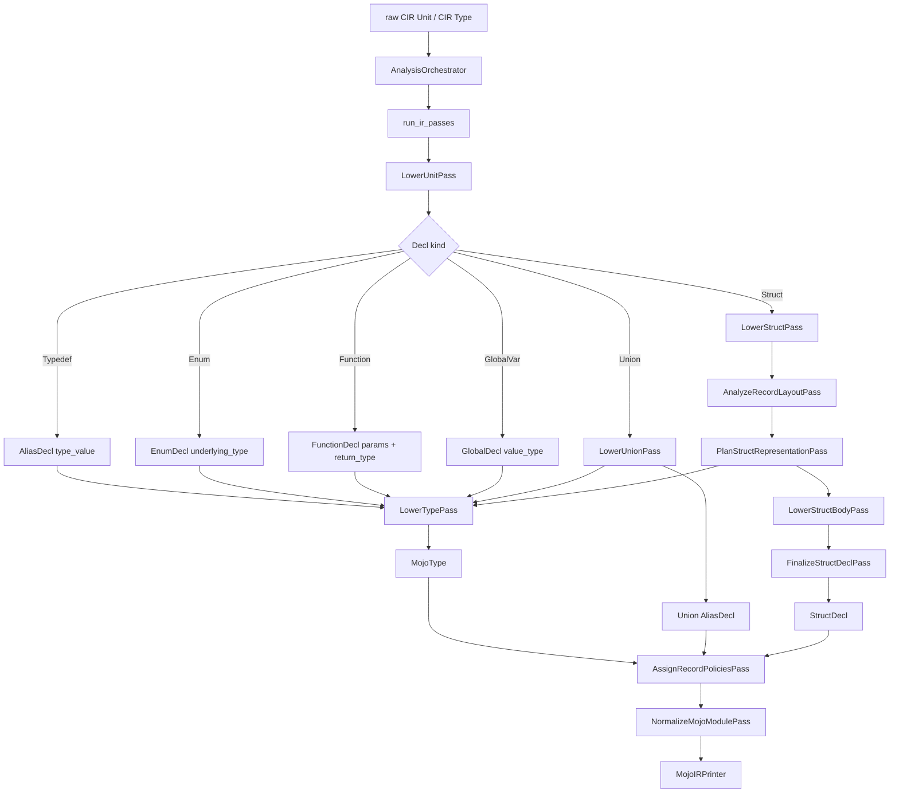

# Analysis Type Lowering Pipeline

This document shows how types move from CIR into MojoIR in the `analysis`
layer.

## Overview

## Pass Responsibilities

### `LowerTypePass`

Converts one CIR `Type` into one valid `MojoType`.

Important rules:
- primitive C scalars lower to `BuiltinType` or fixed-width `NamedType`
- `UnsupportedType(size_bytes=N)` lowers to `ArrayType(UInt8, N)`
- unsized `UnsupportedType` lowers to an opaque pointer
- vectors with unknown lane counts lower to byte storage sized by `size_bytes`
- representable atomics lower to `Atomic[dtype]`
- non-representable atomics fall back to the lowered value type

### `AnalyzeRecordLayoutPass`

Pure CIR layout analysis only.

Outputs:
- plain field layout facts
- bitfield run layout facts
- synthesized padding spans
- structural representability problems

It does **not** call `LowerTypePass`.

### `PlanStructRepresentationPass`

Consumes pure record-layout facts and decides the Mojo-facing representation.

Responsibilities:
- call `LowerTypePass` for plain fields
- call `LowerTypePass` for bitfield storage and logical field types
- choose between:
  - `fieldwise_exact`
  - `fieldwise_padded_exact`
  - `bitfield_exact`
  - `opaque_storage_exact`

### `LowerStructBodyPass`

Builds the ordered `StructDecl.members` list from the chosen representation:
- `StoredMember`
- `PaddingMember`
- `BitfieldGroupMember`
- `OpaqueStorageMember`

### `FinalizeStructDeclPass`

Builds the initial lowered `StructDecl` from the chosen representation:
- `StructKind`
- synthesized initializers
- `align`
- `align_decorator`
- diagnostics

It does not decide trait sets or whether the struct is fieldwise-init eligible.

### `AssignRecordPoliciesPass`

Derives record-level emitted policy after all MojoIR declarations exist:
- record traits
- passability-derived traits
- `fieldwise_init` eligibility

This keeps `LowerStructPass` focused on constructing the lowered struct shape,
while policy decisions happen later with full-module context.

## Type-Level Fallback Rules

These are the current "always lower to valid MojoIR" escape hatches:

| CIR type shape | MojoIR fallback |
| --- | --- |
| `UnsupportedType` with size | `ArrayType(UInt8, size)` |
| `UnsupportedType` without size | opaque `PointerType` |
| `VectorType` with `count=None` | `ArrayType(UInt8, size_bytes)` |
| `FloatKind.FLOAT128` | `ArrayType(UInt8, size_bytes)` |
| `WCHAR` / `CHAR16` / `CHAR32` / `EXT_INT` | fixed-width `NamedType` |

These rules keep the lowering pipeline printable and prevent `MojoBuiltin.UNSUPPORTED`
from leaking into emitted MojoIR.
