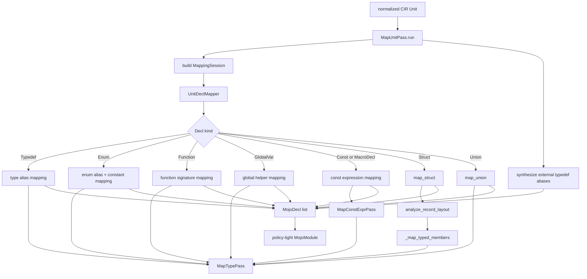

# Analysis Type Mapping Pipeline

This document shows how normalized CIR maps into MojoIR in the `analysis`
layer.

## Overview

## Main Components

### `MapUnitPass`

`MapUnitPass` owns the top-level walk over a normalized CIR `Unit`.

Responsibilities:
- create one shared `MapTypePass`
- create one shared `MapConstExprPass`
- build `StructMappingContext` from the normalized record map and target ABI
- synthesize aliases for externally referenced typedefs that are used but not
  declared locally in the current `Unit`
- delegate each top-level declaration to `UnitDeclMapper`

Source:
- [unit_mapping.py](/home/mohamed/Documents/Projects/mojo_bindgen/mojo_bindgen/analysis/mojo/unit_mapping.py:45)

### `MapTypePass`

`MapTypePass` converts one parser-facing `Type` into one valid Mojo-facing `Type`.

Important rules:
- primitive C scalars map to `BuiltinType` or fixed-width `NamedType`
- exact-width aliases such as `int32_t` and `uint64_t` map to Mojo fixed-width names
- `size_t` and `ssize_t` map to `UInt` and `Int`
- representable atomics map to `Atomic[...]`
- data pointers map to nullable `Pointer`
- vectors map to `SIMD[...]` when lane metadata is usable
- complex values map to `ComplexSIMD[...]`
- unsupported fixed-size types fall back to byte arrays
- unsupported unsized types fall back to opaque external pointers

Source:
- [type_mapping.py](/home/mohamed/Documents/Projects/mojo_bindgen/mojo_bindgen/analysis/mojo/type_mapping.py:132)

### `UnitDeclMapper`

`UnitDeclMapper` is the declaration-family dispatcher inside the mapping
session.

Responsibilities:
- map typedefs and enums into aliases and constants
- map functions into `FunctionDecl`
- map globals into `GlobalDecl`
- map structs through `map_struct(...)`
- map unions through `map_union(...)`
- map CIR constant expressions and macro expressions through `MapConstExprPass`

Source:
- [decl_mapping.py](/home/mohamed/Documents/Projects/mojo_bindgen/mojo_bindgen/analysis/mojo/decl_mapping.py:93)

### `map_struct(...)`

Struct mapping is factored around real record layout analysis plus typed member
planning.

Responsibilities:
- compute pure layout facts with `analyze_record_layout(...)`
- reject incomplete or non-representable layouts onto opaque storage
- map plain stored fields and bitfield storage/logical field types
- synthesize padding members and initializers from analyzed layout facts
- preserve flexible-tail metadata when the enclosing shape stays representable
- attach fallback diagnostics when a record must collapse to opaque storage

Source:
- [struct_mapping.py](/home/mohamed/Documents/Projects/mojo_bindgen/mojo_bindgen/analysis/mojo/struct_mapping.py:56)
- [record_layout.py](/home/mohamed/Documents/Projects/mojo_bindgen/mojo_bindgen/analysis/facts/record_layout.py:48)

### `map_union(...)`

Union mapping decides whether a union can stay as a typed `UnsafeUnion[...]`
surface or must fall back to a conservative layout alias.

Source:
- [union_mapping.py](/home/mohamed/Documents/Projects/mojo_bindgen/mojo_bindgen/analysis/mojo/union_mapping.py:25)

## Type-Level Fallback Rules

These are the current "always map to valid MojoIR" escape hatches:

| CIR type shape | MojoIR fallback |
| --- | --- |
| `UnsupportedType` with size | `Array(UInt8, size)` |
| `UnsupportedType` without size | opaque external `Pointer` |
| `VectorType` with unknown lane count | `Array(UInt8, size_bytes)` |
| `FloatKind.FLOAT128` | `Array(UInt8, size_bytes)` |
| `WCHAR` / `CHAR16` / `CHAR32` / `EXT_INT` | fixed-width `NamedType` |

These rules keep mapping printable and prevent unsupported placeholders from
leaking into emitted MojoIR.

## What This Stage Produces

`MapUnitPass.run(...)` returns a `MojoModule` with:

- top-level declarations mapped into MojoIR
- module-level link metadata copied from the CIR `Unit`
- no final record trait policy yet
- no final import/support-dependency computation yet

Those later concerns are handled by record-policy assignment and MojoIR
normalization.
