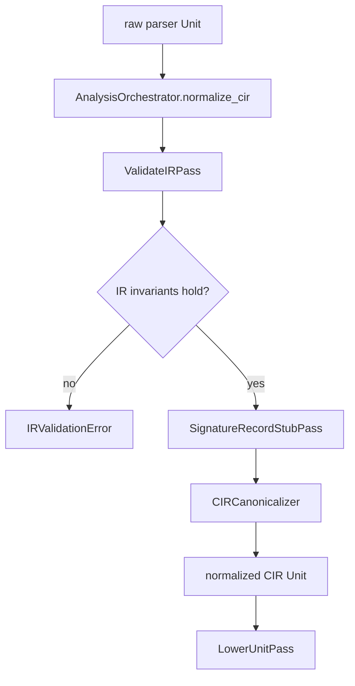

# CIR Pass Workflow

This document shows the current CIR-to-CIR normalization pipeline and where it
fits between parsing and Mojo-facing lowering.

## Overview

## Active Passes

The current CIR normalization sequence is owned by
`AnalysisOrchestrator.normalize_cir()`:

1. `ValidateIRPass`
2. `SignatureRecordStubPass`
3. `CIRCanonicalizer`

Source:
- [orchestrator.py](/home/mohamed/Documents/Projects/mojo_bindgen/mojo_bindgen/analysis/orchestrator.py:26)

## Pass Details

### `ValidateIRPass`

Purpose:
- verify `decl_id` uniqueness across the `Unit`
- require stable identity on declarations and nested reference nodes that need it
- reject malformed `TypeRef`, `StructRef`, and `OpaqueRecordRef` structures early

This is a fail-fast structural correctness gate. It does not rewrite the IR.

Source:
- [validate_ir.py](/home/mohamed/Documents/Projects/mojo_bindgen/mojo_bindgen/analysis/validate_ir.py:17)

### `SignatureRecordStubPass`

Purpose:
- walk reachable CIR type positions and selected const-expression type positions
- find `StructRef` uses that lack a top-level `Struct` declaration
- prepend synthesized incomplete `Struct` declarations for those reachable refs

This ensures later lowering can still emit opaque record stubs for signature-only
record references such as `int f(struct opaque *p);`.

Source:
- [reachability.py](/home/mohamed/Documents/Projects/mojo_bindgen/mojo_bindgen/analysis/reachability.py:153)

### `CIRCanonicalizer`

Purpose:
- apply analysis-owned CIR cleanup before MojoIR lowering
- canonicalize declaration ordering/details that should not remain parser-local
- deduplicate IR nodes where the parser may have produced equivalent duplicates

This keeps downstream lowering working from one normalized CIR shape rather than
raw parser output quirks.

Source:
- [cir_canonicalizer.py](/home/mohamed/Documents/Projects/mojo_bindgen/mojo_bindgen/analysis/cir_canonicalizer.py:1)

## Why These Passes Exist

The parser intentionally stays source-driven and conservative. That means it can
return structurally faithful CIR that still needs:

- validation before deeper analysis
- synthesized incomplete record declarations for signature-only refs
- minor canonical cleanup before module lowering

Analysis owns that repair boundary so parsing can stay focused on faithful C ->
CIR lowering.

## What Comes Next

After CIR normalization, analysis continues with Mojo-facing lowering and
finalization:

1. `LowerUnitPass.run(unit)` lowers normalized CIR into a policy-light `MojoModule`
2. `assign_record_policies(module)` derives struct passability, traits, and fieldwise-init policy
3. `normalize_mojo_module(module)` makes printer-facing facts explicit

So the CIR pass layer is intentionally narrow: validate, materialize
signature-only record stubs, canonicalize, then hand off to MojoIR lowering.
