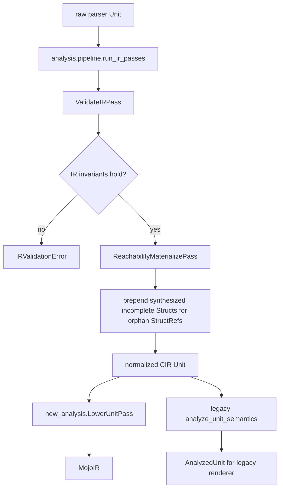

# CIR Pass Workflow

This document shows the current CIR-to-CIR pass pipeline and where it sits
between parsing and later Mojo-facing lowering.

## Overview

## Active Passes

The current `run_ir_passes()` implementation is short and explicit:

1. `ValidateIRPass`
2. `ReachabilityMaterializePass`

Source:
- [pipeline.py](/home/mohamed/Documents/Projects/mojo_bindgen/mojo_bindgen/analysis/pipeline.py:9)

## Pass Details

### `ValidateIRPass`

Purpose:
- verify `decl_id` uniqueness across the `Unit`
- require `decl_id` on typedefs and structs
- verify nested type references are structurally valid
- reject malformed `TypeRef`, `StructRef`, and `OpaqueRecordRef` nodes that
  lack identity

This is a fail-fast structural correctness gate. It does not rewrite the IR.

Source:
- [validate_ir.py](/home/mohamed/Documents/Projects/mojo_bindgen/mojo_bindgen/analysis/validate_ir.py:17)

### `ReachabilityMaterializePass`

Purpose:
- walk all reachable CIR types and selected const-expression type positions
- collect orphan `StructRef` uses that have no top-level `Struct` declaration
- prepend synthesized incomplete `Struct` declarations for those refs

This ensures downstream consumers can emit opaque struct stubs for external or
indirectly referenced record types.

Source:
- [reachability.py](/home/mohamed/Documents/Projects/mojo_bindgen/mojo_bindgen/analysis/reachability.py:153)

## Why These Passes Exist

The parser is intentionally source-driven and local. That means it can produce
valid-looking references to records that never appeared as top-level
declarations in the primary header. `ReachabilityMaterializePass` repairs that
for global downstream consistency.

`ValidateIRPass` comes first so the reachability walk only runs over structurally
sound CIR.

## What Is Not a CIR Pass

These happen after the CIR pass pipeline and should be thought of separately:

- `new_analysis.LowerUnitPass`: CIR -> MojoIR
- `analysis.analyze_unit_semantics`: CIR -> legacy analyzed render model
- `normalize_mojo_module`: MojoIR -> printer-ready MojoIR

So the current CIR pass layer is intentionally narrow: validate first, then
materialize reachable opaque records.
