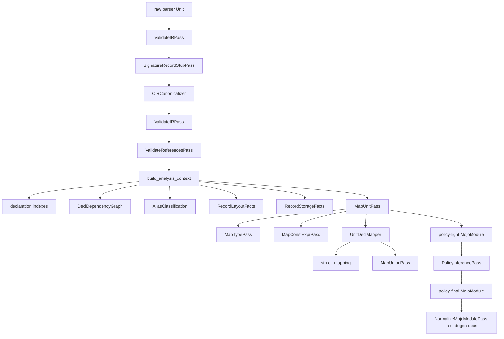

# Analysis Pass Pipeline

This is the main reference for analysis-owned passes in `mojo-bindgen`.
Analysis starts with a raw parser `Unit`, validates and normalizes CIR, computes
shared facts, maps into policy-light MojoIR, and assigns late Mojo record
policies.

`NormalizeMojoModulePass` is intentionally not documented here in detail. It is
codegen-facing and has its own reference:
[mojo_ir_normalization_pipeline.md](mojo_ir_normalization_pipeline.md).

## Overview

The compatibility entry points are:

- `run_ir_passes(unit)`: validates and normalizes CIR.
- `map_unit(unit)`: maps normalized CIR, building fallback context if needed.
- `AnalysisOrchestrator.analyze_with_artifacts(unit)`: returns the stable public
  `AnalysisResult`.
- `AnalysisOrchestrator.analyze_pipeline(unit)`: returns `AnalysisArtifacts`
  with normalized CIR, `AnalysisContext`, policy-light MojoIR, and final MojoIR.

## Stage 1: CIR Validation And Normalization

These passes operate on C-facing IR (`Unit`) and must not depend on MojoIR.

### `ValidateIRPass`

Purpose:

- verify stable declaration identity where downstream passes require it
- reject conflicting duplicate `decl_id` values
- require `decl_id` on `Typedef`, `Struct`, `TypeRef`, `StructRef`, and
  `OpaqueRecordRef` positions that participate in cross-reference analysis
- validate declaration and constant-expression type slots through the shared
  traversal helpers

Placement:

- runs first on raw parser CIR
- runs again after CIR repair/canonicalization

It does not prove ABI representability or reference reachability. Those are
owned by later analysis passes.

### `SignatureRecordStubPass`

Purpose:

- walk reachable type positions in functions, typedefs, records, globals,
  constants, and macros
- optionally walk const-expression type positions
- synthesize incomplete `Struct` declarations for signature-only `StructRef`
  uses that have no top-level record declaration

This keeps signatures such as `int f(struct opaque *p);` mappable as opaque
Mojo record stubs.

### `CIRCanonicalizer`

Purpose:

- keep one record declaration per `decl_id`, preferring complete definitions
- deduplicate equivalent function declarations
- keep the last definition for repeated macro names
- drop self-alias macros already represented by constants or enumerants
- choose enum primary names from typedef/tag information
- rewrite enum references to the chosen primary names

The canonicalizer returns a fresh `Unit`; callers should not rely on mutation of
the raw parser result.

### `ValidateReferencesPass`

Purpose:

- reject normalized CIR references that should resolve but do not
- require `EnumRef` declarations to exist in the normalized `Unit`
- require concrete non-union `StructRef` declarations to exist after signature
  stub materialization
- allow external typedef references, because `MapUnitPass` can synthesize
  external typedef aliases
- allow `OpaqueRecordRef` to remain opaque/external

This is the dangling-reference gate for normalized CIR.

## Stage 2: Shared Analysis Context

`build_analysis_context(unit)` computes reusable whole-unit facts after CIR is
normalized and reference-validated. This stage should absorb analysis work that
would otherwise be repeated inside mappers.

### Declaration Indexes

`analysis.facts.indexes` owns declaration lookup construction. `AnalysisContext`
stores the resulting normalized declarations by stable keys:

- records by `decl_id`
- typedefs by `decl_id`
- enums by `decl_id`
- functions by `decl_id`
- globals by `decl_id`
- constants by name
- macros by name

These indexes are the basic lookup surface for later passes.

### Shared Traversal Internals

`analysis.traversal` owns declaration and constant-expression walking:

- direct type slots on functions, typedefs, records, globals, constants, and
  macros
- type slots nested in cast and `sizeof` constant expressions
- symbol references inside constant expressions
- typedef/reference discovery across whole units

Passes should use these helpers instead of each defining bespoke declaration or
const-expression walkers. `analysis.type_walk` remains the lower-level helper
for recursive `Type` trees only.

### `DeclDependencyGraph`

Purpose:

- record type-reference edges from declarations to typedefs, records, and enums
- record symbol-reference edges from constant expressions and macros
- provide a foundation for diagnostics, stable ordering, and future
  allowlist/pruning support

This pass is fact-building only; it does not reorder or delete declarations.

### `AliasClassification`

Purpose:

- classify local typedef declarations
- classify external typedef references found in type positions
- identify callback typedefs, enum aliases, record aliases, exact-width stdint
  aliases, ordinary typedefs, and external typedefs

This keeps alias meaning available as shared facts instead of rediscovering it
inside mappers.

### `RecordLayoutFacts`

Purpose:

- analyze physical record layout from CIR offsets/sizes
- compute plain field facts, bitfield storage runs, padding spans, natural typed
  alignment, and layout problems
- preserve incomplete-record facts without forcing a mapping decision

`analyze_record_layout()` owns pure C-layout checks. It does not decide how a
Mojo `StructDecl` should be emitted.

### `RecordStorageFacts` / `RecordStorageAnalyzer`

Purpose:

- centralize record storage and representability decisions
- classify record storage as incomplete, union, typed, or opaque storage
- validate direct and embedded flexible-tail patterns
- analyze recursive by-value record storages
- carry flexible-tail metadata for struct mapping
- carry fallback reasons for opaque-storage diagnostics

This is the central Mojo storage-decision pass. `struct_mapping` consumes these
facts and performs MojoIR member construction; it should not own recursive
typed-vs-opaque policy. Its internal helpers are split by responsibility:
record prechecks, plain-field checks, embedded-record/flexible-tail checks, and
bitfield checks.

## Stage 3: CIR To MojoIR Mapping

Mapping consumes normalized CIR plus `AnalysisContext` and produces a
policy-light `MojoModule`. These passes are Mojo-facing, but still live in
analysis because they convert analyzed CIR into MojoIR.

### `MapUnitPass`

Purpose:

- create shared mappers for one unit
- synthesize aliases for external typedef references from `AliasClassification`
- map top-level declarations through `UnitDeclMapper`
- build module metadata and linking mode

`map_unit(unit)` remains a compatibility helper. If no `AnalysisContext` is
provided, it builds one internally.

### `UnitDeclMapper`

Purpose:

- dispatch each top-level CIR declaration to the correct mapper
- map typedefs, enums, functions, globals, constants, macros, structs, and
  unions
- preserve declaration order except for intentionally synthesized aliases

This is orchestration, not whole-unit analysis. New cross-declaration facts
should generally be added to `AnalysisContext`.

Typedef alias construction is centralized in `alias_mapping`, so local typedefs
and external typedef aliases share callback, exact-width stdint, and no-op
self-alias handling.

### `MapTypePass`

Purpose:

- map CIR types to MojoIR type nodes
- preserve named typedef/record/enum surfaces as `NamedType`
- map pointers, arrays, function pointers, atomics, vectors, complex values,
  and unsupported sized types

This is a recursive type mapper. It does not decide declaration reachability or
record storage policy.

### `MapConstExprPass`

Purpose:

- map CIR constant-expression nodes to MojoIR constant-expression nodes
- map cast and `sizeof` target types through `MapTypePass`
- reject constant forms that have no direct MojoIR value form, such as null
  pointer literals

Macro emission policy lives in `MacroMapper`; expression mapping only rewrites
supported expression shapes.

### Macro Mapping

Purpose:

- map supported object-like macros to MojoIR value aliases
- block macro forms that would be misleading in Mojo, such as null pointer
  macros and C logical operators
- preserve unsupported macro spellings as diagnostic comment aliases
- track emitted constants so self-alias and name-conflict handling is
  deterministic

### Struct Mapping

Purpose:

- consume `RecordStorageFacts` and `RecordLayoutFacts`
- emit opaque declarations for incomplete records
- emit byte-storage structs for opaque-storage decisions
- map typed plain fields and bitfield groups to MojoIR members
- attach flexible-tail metadata computed by record analysis
- compute Mojo alignment decorator policy

Struct mapping should not recompute recursive record storage decisions.
Typed-member mapping is intentionally split between plain fields, bitfield
storage, and bitfield logical fields so fallback diagnostics stay local to the
operation that failed.

### `MapUnionPass`

Purpose:

- map complete unions to `UnsafeUnion[...]` when member types are distinct and
  representable
- fall back to `InlineArray[UInt8, size]` when union mapping would be unsafe or
  ambiguous
- emit placeholder aliases for incomplete unions

Union mapping remains separate because unions map to alias-style layout
types, not `StructDecl`.
Its implementation is structured as union-arm collection followed by either
`UnsafeUnion[...]` alias construction or byte-storage fallback construction.

## Stage 4: Late MojoIR Policy Analysis

### `PolicyInferencePass`

Purpose:

- infer record passability
- assign Mojo traits
- decide fieldwise initializer eligibility
- handle recursion, opaque storage, arrays, atomics, pointers, aliases, and
  nested records

This pass runs after CIR-to-MojoIR mapping because it reasons over final MojoIR
types and declaration relationships.

## Codegen Boundary

After `PolicyInferencePass`, analysis hands a policy-final `MojoModule` to
codegen. `NormalizeMojoModulePass` then makes printer-facing facts explicit:
callback alias hoisting, imports, support declarations, final call targets, and
nested type normalization.

That codegen-facing pass is documented separately in
[mojo_ir_normalization_pipeline.md](mojo_ir_normalization_pipeline.md).
