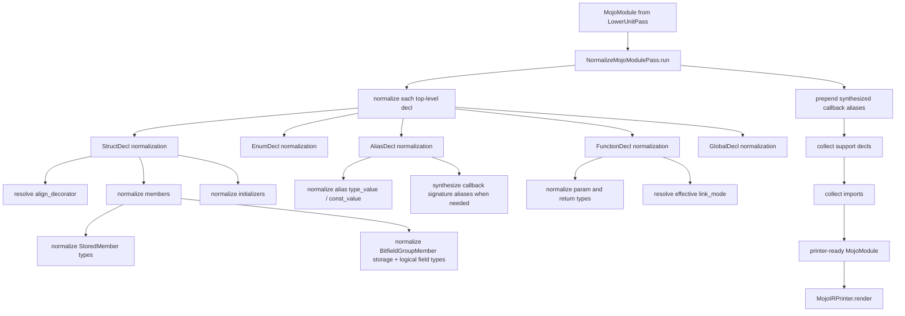

# MojoIR Normalization Workflow

This document shows how `normalize_mojo_module()` turns lowered MojoIR into the
printer-ready form consumed by the final rendering step inside the
analysis-owned orchestration boundary.

## Overview



## Main Responsibilities

### 1. Make all printer-facing facts explicit

Normalization removes printer guesswork by rewriting declarations into a form
the printer can emit directly.

Examples:
- if `StructDecl.align_decorator` is missing, derive it from `align`
- normalize every nested type position
- normalize every initializer parameter type
- normalize constant-expression cast and `sizeof` targets

Primary implementation:
- [normalize_mojo_module.py](/home/mohamed/Documents/Projects/mojo_bindgen/mojo_bindgen/analysis/normalize_mojo_module.py:49)

### 2. Lift callback types into named aliases when needed

Inline callback-like types are normalized and, when necessary, replaced with a
synthetic named alias such as `foo_cb`.

This gives the printer a stable named surface instead of having to emit nested
callback signatures inline in arbitrary positions.

Relevant logic:
- `_callback_type_from_type(...)`
- `_ensure_callback_alias(...)`

### 3. Compute support declarations

After declaration normalization, the pass scans the module and adds helper
support blocks when required.

Examples:
- DL handle helpers
- global symbol helpers

This is derived from both module capabilities and normalized declaration kinds.

### 4. Compute final imports

Normalization also determines imports implied by the final IR:
- `std.ffi` names such as `external_call`, `OwnedDLHandle`, `UnsafeUnion`, and
  `c_*` builtins
- `std.memory` opaque pointer imports
- `std.builtin.simd` for `SIMD`
- `std.complex` for `ComplexSIMD`
- `std.atomic` for `Atomic`

The printer consumes these imports as already-decided facts.

## Type Normalization Rules

`_normalize_type()` recursively handles:
- `BuiltinType`
- `NamedType`
- `PointerType`
- `ArrayType`
- `ParametricType`
- `CallbackType`
- `FunctionType`

If a callback shape appears in a non-inline position, normalization can rewrite
it to:

```text
PointerType(pointee=NamedType("<synthesized_callback_alias>"))
```

That rewrite is part of the normalization contract, not the printer.

## End-to-End Placement

The current public printer path is:

1. `AnalysisOrchestrator.run_ir_passes(unit)` repairs raw CIR
2. `LowerUnitPass.run(unit)` produces a policy-free `MojoModule`
3. `assign_record_policies(module)` derives late record traits and fieldwise-init policy
4. `normalize_mojo_module(module)` makes printer-facing facts explicit
5. `MojoIRPrinter.render(module)` emits Mojo source

Source:
- [mojo_ir_printer.py](/home/mohamed/Documents/Projects/mojo_bindgen/mojo_bindgen/codegen/mojo_ir_printer.py:528)

So normalization is the last analysis rewrite stage before codegen text
emission.
