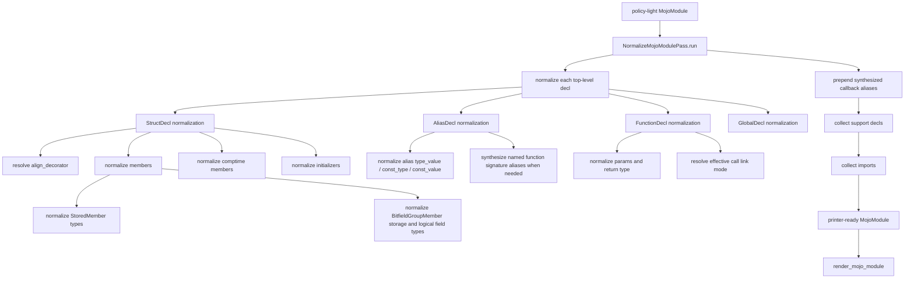

# MojoIR Normalization Workflow

This document shows how `normalize_mojo_module()` turns mapped MojoIR into the
printer-ready form consumed by the final rendering step.

## Overview

## Main Responsibilities

### 1. Make printer-facing facts explicit

Normalization removes printer guesswork by rewriting declarations into a form
the printer can emit directly.

Examples:
- if `StructDecl.align_decorator` is missing, derive it from `align`
- normalize every nested type position
- normalize every initializer parameter type
- normalize constant-expression cast and `sizeof` targets
- resolve effective per-function link mode into explicit call targets

Primary implementation:
- [normalize_mojo_module.py](/home/mohamed/Documents/Projects/mojo_bindgen/mojo_bindgen/codegen/normalize_mojo_module.py:49)

### 2. Lift function-signature types into named aliases when needed

`FunctionPtr` may appear nested inside pointers, aliases, or other type
positions. Normalization gives those signatures stable names when they should
not remain inline.

That rewrite typically turns a nested function signature into a synthesized
alias name that other declarations can reference directly.

Relevant logic:
- `_function_type_from_type(...)`
- `_ensure_function_alias(...)`

### 3. Compute support declarations

After declaration normalization, the pass scans the module and adds helper
support blocks when required.

Examples:
- owned-DL handle helpers
- global symbol helpers

This is derived from the normalized declarations and the module link mode.

### 4. Compute final imports

Normalization also determines imports implied by the final IR:
- `std.ffi` names such as `external_call`, `OwnedDLHandle`, `UnsafeUnion`, and
  C ABI scalar names
- pointer and optional support types
- `SIMD`, `ComplexSIMD`, and `Atomic` support imports

The printer consumes these imports as already-decided facts.

## Type Normalization Rules

`_normalize_type()` recursively handles:
- `BuiltinType`
- `NamedType`
- `Pointer`
- `Array`
- `ParametricType`
- `FunctionPtr`

If a function-signature shape appears in a non-inline position, normalization
can rewrite it to a synthesized named alias instead of leaving it inline. That
rewrite is part of the normalization contract, not printer logic.

## End-to-End Placement

The current public render path is:

1. `AnalysisOrchestrator.run_ir_passes(unit)` validates and normalizes raw CIR
2. `build_analysis_context(unit)` computes shared declaration and layout facts
3. `MapUnitPass.run(unit)` produces a policy-light `MojoModule`
4. `PolicyInferencePass` derives late record passability, traits, and fieldwise-init policy
5. `normalize_mojo_module(module)` makes printer-facing facts explicit
6. `render_mojo_module(module, options)` emits Mojo source

Source:
- [orchestrator.py](/home/mohamed/Documents/Projects/mojo_bindgen/mojo_bindgen/orchestrator.py:79)

So normalization is the last structural rewrite stage before text emission.
