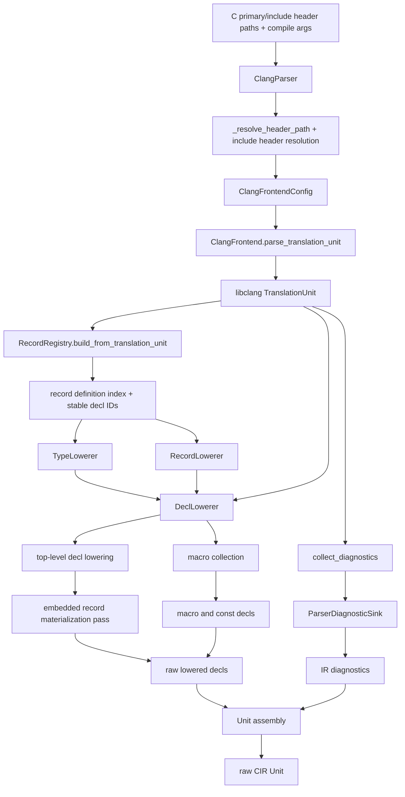

# Parsing Pipeline: C Source to CIR

This document shows the current parser path from a C header on disk to the raw
CIR `Unit` returned by `ClangParser.run()`. Analysis-owned passes start only
after this hand-off.

## Overview

## Stage Boundaries

### 1. Frontend setup

`ClangParser._build_parser_session()` creates the frontend boundary:
- resolves the primary header path and any additional include header paths
- computes effective compile arguments
- asks libclang to parse one translation unit, using a virtual umbrella header
  when multiple include headers are configured
- collects frontend diagnostics
- builds a `RecordRegistry` for stable record identity and lookup
- probes target ABI metadata from compile arguments

This stage is in:
- [parser.py](/home/mohamed/Documents/Projects/mojo_bindgen/mojo_bindgen/parsing/parser.py:87)
- [frontend.py](/home/mohamed/Documents/Projects/mojo_bindgen/mojo_bindgen/parsing/frontend.py:92)
- [registry.py](/home/mohamed/Documents/Projects/mojo_bindgen/mojo_bindgen/parsing/registry.py:86)
- [target_abi.py](/home/mohamed/Documents/Projects/mojo_bindgen/mojo_bindgen/parsing/target_abi.py:1)

### 2. Raw declaration lowering

`DeclLowerer` walks top-level cursors from the configured emission headers and
delegates by declaration family:
- functions, typedefs, enums, globals: lowered directly by `DeclLowerer`
- structs and unions: delegated to `RecordLowerer`
- macros: collected after cursor traversal

This stage is intentionally source-faithful. It does not do post-parse semantic
repair.

Key modules:
- [decl_lowering.py](/home/mohamed/Documents/Projects/mojo_bindgen/mojo_bindgen/parsing/lowering/decl_lowering.py:31)
- [record_lowering.py](/home/mohamed/Documents/Projects/mojo_bindgen/mojo_bindgen/parsing/lowering/record_lowering.py:205)
- [type_lowering.py](/home/mohamed/Documents/Projects/mojo_bindgen/mojo_bindgen/parsing/lowering/type_lowering.py:71)

### 3. Record-specific lowering

`RecordLowerer` owns physical field discovery and record materialization:
- discovers normalized field sites, including direct anonymous record members
- preserves Clang byte offsets and bitfield offsets
- lowers nested inline records through the registry cache
- emits incomplete `Struct` rows for forward declarations when needed

The output here is still raw CIR `Struct` data, not a Mojo-facing layout plan.

### 4. Embedded record materialization

After the first top-level sweep, `ClangParser` does a follow-up pass that
materializes complete named record definitions required by embedded-by-value
fields, even when those definitions came from transitively included headers.

This keeps the raw CIR self-contained enough for later layout-sensitive
analysis.

### 5. Unit assembly

`ClangParser.run()` and `ClangParser.run_raw()` both assemble:
- `source_header`
- `library`
- `link_name`
- `target_abi`
- raw lowered `decls`
- parser diagnostics converted to IR diagnostics

This produces a source-faithful but not yet normalized `Unit`.

### 6. Hand-off boundary

`ClangParser.run()` stops at raw CIR. Any later CIR normalization or lowering
belongs to the analysis layer, not the parser. In the current code shape that
means `AnalysisOrchestrator` owns:

- CIR validation
- reachability materialization
- CIR canonicalization
- CIR -> MojoIR lowering
- late record policy assignment
- MojoIR normalization

## Output Shapes

There are two useful parser entry points:

| Entry point | Output |
| --- | --- |
| `ClangParser.run_raw()` | raw source-faithful CIR `Unit` |
| `ClangParser.run()` | raw source-faithful CIR `Unit` |

Both entry points currently expose the parser boundary before analysis-owned CIR
repair.
